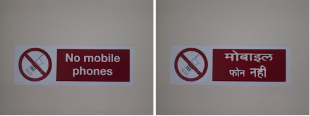

<h1 align='center'>Show Me the World in My Language: Establishing the First Baseline for Scene-Text to Scene-Text Translation (Official code)</h1>
<p align='center'>
    <a href="https://icpr2024.org/"></a>
    <a href="https://arxiv.org/abs/2308.03024"></a>
    <a href="https://github.com/Bhashini-IITJ/visualTranslation/blob/main/LICENSE"></a>
    <a href="https://vl2g.github.io/projects/visTrans/"></a>
</p>
Implementation of Baseline for Scene Text-to-Scene Text Translation



# Getting started
Please follow the below instructions for inference on our VT-Real dataset. For detailed information for specific tasks check the [Documentation](#documentation)

1. Clone the repo and set up the required dependencies
    ```bash
    git clone https://github.com/Bhashini-IITJ/visualTranslation.git
    source ./setup.sh
    ```

2. Download the input VT-Real images (which are to be translated) (download details in the [Project page](https://vl2g.github.io/projects/visTrans/)) and put them in folders **source_eng** (Icdar images) and **source_hin**  (BSTD images) in the project directory.

3. Download the translation checkpoints [eng_hin.model](https://drive.google.com/file/d/1OqloAgsdf-L9hmoeYCW3qrLdtNTQJisx/view?usp=sharing) and [hin_eng.model](https://drive.google.com/file/d/1qb9aUjgGp53lJdfLPUnCVb7mEbd5-gNi/view?usp=sharing) and put them in a folder named **model** inside the project directory.

4. We need an "i_s_info.json" file carrying the information of word-level bounding boxes.Different files are required for different languages and different baselines based on whether we use DBNet+Parseq or oracle bounding boxes.
5. Download the json file from the below table based on the baseline, rename it as i_s_info.json and place it in the project directory


| **Language** | **B-4** | **B-5** | **B-6** | **B-7** |
| :-------: | :-------: | :-------: | :-------: | :-------: |
| Eng -> Hin | [DBNet+Parseq](https://drive.google.com/file/d/1S8ayCLhO2EugF3CLQnHm9J7jJEAq8Hr_/view?usp=drive_link) | [Oracle](https://drive.google.com/file/d/1B3NZYJXMBwobUgJcXMN2WP0wa00W8Npi/view?usp=drive_link) | [DBNet+Parseq](https://drive.google.com/file/d/1S8ayCLhO2EugF3CLQnHm9J7jJEAq8Hr_/view?usp=drive_link) | [DBNet+Parseq](https://drive.google.com/file/d/1S8ayCLhO2EugF3CLQnHm9J7jJEAq8Hr_/view?usp=drive_link) |
| Hin -> Eng | [DBNet+Parseq](https://drive.google.com/file/d/1_gaRIPHlHgtzxbB_9GpzeISUxe5NRTG2/view?usp=sharing) | [Oracle](https://drive.google.com/file/d/1F_IddWKhw4C4UXOEzH-8a3_4VNqCTias/view?usp=sharing) | [DBNet+Parseq](https://drive.google.com/file/d/1_gaRIPHlHgtzxbB_9GpzeISUxe5NRTG2/view?usp=sharing) | [Oracle](https://drive.google.com/file/d/1F_IddWKhw4C4UXOEzH-8a3_4VNqCTias/view?usp=sharing) |

6. Then run one of the below commands based on the required baseline and language translation direction
  ### Eng - Hin
  #### B4
  ```bash
  source ./infer.sh -i source_eng -o output -f i_s_info.json --M2M
  ```
  #### B5 and B6 
  (both have same command only i_s_info.json will be different)

  ```bash
  source ./infer.sh -i source_eng -o output -f i_s_info.json 
  ```

  #### B7
  Add an extra --de flag
  ```bash
  source ./infer.sh -i source_eng -o output -f i_s_info.json --de
  ```

  ### Hin - Eng
  #### B4
  ```bash
  source ./infer.sh -i source_hin -o output -f i_s_info.json --M2M --hin_eng
  ```
  #### B5 and B6 

  ```bash
  source ./infer.sh -i source_hin -o output -f i_s_info.json --hin_eng
  ```

  #### B7
  Add an extra --de flag
  ```bash
  source ./infer.sh -i source_hin  -o output -f i_s_info.json --de --hin_eng
  ```
  
# Documentation
## Environment setup for pipeline
To setup the environment and necessary packages and libraries, run the following command:
```bash
source ./setup.sh
```
please note that this script is for debian or ubuntu based systems. For other systems, please refer to the respective package managers.

Create a folder called 'model' and put the models in the folder.

eng-hin model : [link](https://drive.google.com/file/d/1OqloAgsdf-L9hmoeYCW3qrLdtNTQJisx/view?usp=sharing)

hin-eng model : [link](https://drive.google.com/file/d/1qb9aUjgGp53lJdfLPUnCVb7mEbd5-gNi/view?usp=sharing)
## End-to-end usage 
Input of the pipeline is the left image from above images and output of the pipeline is the right image from above images. To get the result out of the this pipeline, you could run the following command:
```bash
source ./infer.sh -i <image_folder_path> -o <output_folder_path> -f <image_info_file> [ --M2M --hin_eng --de]
```
The following are the options for the command:
- -i: the path to the folder containing the full Scene images
- -o: the path to the folder where the output (full scene) will be saved
- -f: the path to the json file containing the information of words in the image.
- --M2M: use M2M translation model otherwise the indicTrans2 model will be used.
- --hin_eng: use Hindi-English translation model otherwise English-Hindi translation model will be used.
- --de: use Design Enhancements in the pipeline

Note:
1. The format of the json file should be like this:
```json
{
    "100_0":{
        "txt": "hello",
        "bbox": [x1, y1, x2, y2]
    },
    ...
}
```
where "bbox" are top-left and bottom-right coordinate

2. For the purpose of running inference on the VT Real dataset, you can use the json files we provide in the [Real Dataset](#real-dataset) section

3. If you are using the --hin_eng option, then change the path of model in parameter 'checkpoint' in cfg.py files
## Dataset generation
The dataset generation script is designed for ImageMagick v6 but can also work with ImageMagick v7, although you may encounter several warnings. The dataset can be generated for either English-to-Hindi (eng-hin) or Hindi-to-English (hin-eng) translations.

### Setup Instructions:
1. Download this folder and add it to this repository.
2. Unzip all the files within the folder.
3. Install the fonts located in the devanagari.zip file.
### Generating the Dataset:
To generate the dataset, run the following command:
```bash
./dataset_gen.sh [ --num_workers <number of loops> --per_worker <number of samples per loop> --hin_eng]
```
Command Options:
--num_workers: Specifies the number of workers for dataset generation. Default: 20.
--per_worker: Specifies the number of samples per loop. Default: 3000.
--hin_eng: Generates a Hindi-to-English (hin-eng) dataset. If not specified, the dataset will be generated for English-to-Hindi (eng-hin).
Note: To generate a dataset for other language pairs, modify the commands in data_gen.py accordingly.
## Real Dataset
The VT Real Dataset used in the project as the evaluation. Two datasets are used for evaluation. They are:
1. [BSTD](https://github.com/Bhashini-IITJ/BharatSceneTextDataset)
2. [ICDAR 13](https://rrc.cvc.uab.es/?ch=2&com=downloads)

please download the dataset from link above and json file can be found from link below:
1. [BSTD](https://drive.google.com/file/d/1_gaRIPHlHgtzxbB_9GpzeISUxe5NRTG2/view?usp=sharing)
2. [ICDAR](https://drive.google.com/file/d/1_gaRIPHlHgtzxbB_9GpzeISUxe5NRTG2/view?usp=sharing)
## 1. SRNet++

SRNet++ can be trained with the following command:
```bash
conda activate srnet_plus_2
python train_o_t.py
```
change the path of 'data_dir' parameter in cfg.py file if you are using dataset with different path than default.

SRNet++ can be infered with following command lines:
```bash
conda activate srnet_plus_2
python generate_o_t.py
```
please change the path according to your use case. The inputs for the inferece are i_s and i_t. Example given below.
|**i_s**|**i_t**|
|:--:|:--:|
|||

## 2. scene-text detection/recognition
In this project use SOTA scene text detection/recognition model, To form the json file which contains the information of what and where is the word. The Scene Text Detection and Recognition models are DBNet and ParSeq respectively. The file has to be in the following format:

```json
{
    "100_0":{
        "txt": "hello",
        "bbox": [x1, y1, x2, y2]
    },
    ...
}
```

## 3. scene-text eraser
The trained model for the controlnet-stablediffusion is used for the scene text eraser.

## 4. Machine translation
This project is using two different model for Machine Translation. Both are implemented in this pipeline and can be used by above mentained flags. The two models are:
1. facebook-M2M
2. IndicTrans2

## 5. Design enhancement
To enhance the design, a series of refined and newly introduced steps have been implemented. The enhancement along with their respective files are:
- The process begins with the detection and recognition of text, after which numbers, websites, and email addresses are filtered out using regular expressions. : exclude_key_works.py
- Words are then grouped into paragraphs and lines based on the geometry and coordinates of the bounding box, in conjunction with a heuristic function. : detect_para.py
- These paragraphs are translated and segmented into lines, ensuring alignment with the proportion of lines present in each original paragraph. Through cubic spline interpolation, new coordinates for each word within a line are determined, which are then linked back to the original crops of the words. : form_word_cropts.py, translate_de.py
- Depending on the new width of the translated words, adjustments are made to the crops—either cutting or replicating them—to maintain the original style of the text. : modify_crops.py

## Warning and troubleshooting
- please make sure that imagemagick support png format after the setup.
- Data generation code is written for imagemagickv6. It would work for imagemagickv7 but you will have a lots of warnings. 
## Bibtex (how to cite us)
```
@InProceedings{vistransICPR2024,
    author    = {Vaidya, Shreyas and Sharma, Arvind Kumar and Gatti, Prajwal and Mishra, Anand},
    title     = {Show Me the World in My Language: Establishing the First Baseline for Scene-Text to Scene-Text Translation},
    booktitle = {ICPR},
    year      = {2024},
}
```

## Acknowledgements
1. [SRNet](https://github.com/lksshw/SRNet)
2. [indic scene text render](https://github.com/mineshmathew/IndicSceneTextRendering)
3. [Scene text eraser](https://github.com/Onkarsus13/Diff_SceneTextEraser)
4. [facebook-m2m](https://huggingface.co/facebook/m2m100_418M)
5. [IndicTrans2](https://github.com/AI4Bharat/IndicTrans2)
6. [Contrique]()

## Contact info
1. Arvind Kumar Sharma - arvindji0201@gmail.com
