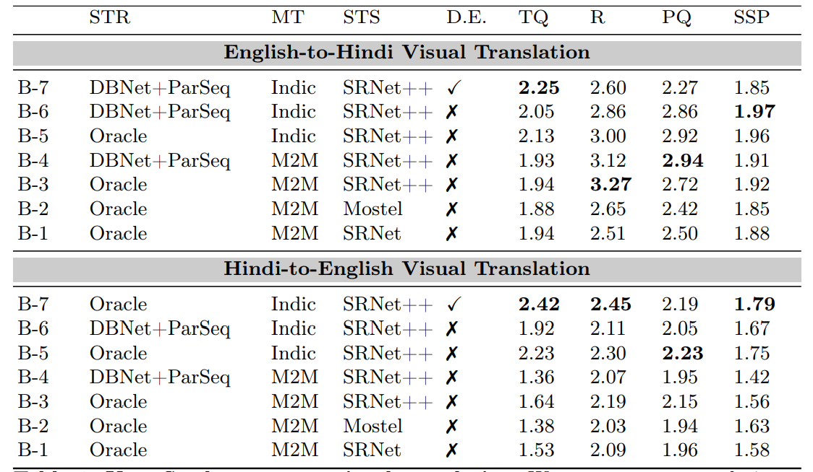

<h1 align='center'>Visual Translation</h1>
<p align='center'>
    <a href="https://icpr2024.org/"></a>
    <a href="https://arxiv.org/abs/2308.03024"></a>
    <a href="https://github.com/Bhashini-IITJ/visualTranslation/blob/main/LICENSE"></a>
    <a href="https://vl2g.github.io/projects/visTrans/"></a>
</p>
Implementation of Baseline for Scene Text-to-Scene Text Translation

# Environment setup for pipeline
To setup the environment and necessary packages and libraries, run the following command:
```bash
source ./setup.sh
```
please note that this script is for debian or ubuntu based systems. For other systems, please refer to the respective package managers.

Create a folder called 'model' and put the models in the folder.

eng-hin model : [link](https://drive.google.com/file/d/1OqloAgsdf-L9hmoeYCW3qrLdtNTQJisx/view?usp=sharing)

hin-eng model : [link](https://drive.google.com/file/d/1qb9aUjgGp53lJdfLPUnCVb7mEbd5-gNi/view?usp=sharing)
# End-to-end usage 
To get the result out of the this pipeline, you could run the following command:
```bash
source ./infer.sh -i <image_folder_path> -o <output_folder_path> -f <image_info_file> [ --M2M --hin_eng --de]
```
The following are the options for the command:
- -i: the path to the folder containing the images
- -o: the path to the folder where the output will be saved
- -f: the path to the json file containing the information of word in the image.
- --M2M: use M2M translation model otherwise the indicTrans2 model will be used.
- --hin_eng: use Hindi-English translation model otherwise English-Hindi translation model will be used.
- --de: use Design Enhancements in the pipeline

Note:
1. The format of the json file should be like this:
```json
{
    "100_0":{
        "txt": "hello",
        "bbox": [x1, y1, x2, y2]
    },
    ...
}
```
2. if you are using the --hin_eng option, then change the path of model in parameter 'checkpoint' in cfg.py files
# 1. SRNet++ (previously called vtnet)

SRNet++ can be trained with the following command:
```bash
conda activate vtnet
python train_o_t.py
```
change the path of 'data_dir' parameter in cfg.py file if you are using dataset with different path than default.

SRNet++ can be infered with following command lines:
```bash
conda activate vtnet
python generate_o_t.py
```
please change the path according to your use case. The inputs for the inferece are i_s and i_t. Example given below.

# 2. scene-text detection/recognition
In this project use SOTA scene text detection/recognition model, To from the file which contain the information of what and where is the word. The Scene Text Detection and Recognition models are DBNet and ParSeq respectively. The file is in the following format:

```json
{
    "100_0":{
        "txt": "hello",
        "bbox": [x1, y1, x2, y2]
    },
    ...
}
```

# 3. scene-text eraser
The trained model for the controlnet-stablediffusion is used for the scene text eraser. The link to the github for it : [link](https://github.com/Onkarsus13/Diff_SceneTextEraser)

# 4. Machine translation
This project is using two different model for Machine Translation. Both are implemented in this pipeline and can be used by above mentained flags. The two models are:
1. [facebook-M2M](https://huggingface.co/facebook/m2m100_418M)
2. [IndicTrans2](https://github.com/AI4Bharat/IndicTrans2)

# 5. Design enhancement
To enhance the design, a series of refined and newly introduced steps have been implemented. The enhancement along with their respective files are:
- The process begins with the detection and recognition of text, after which numbers, websites, and email addresses are filtered out using regular expressions. : exclude_key_works.py
- Words are then grouped into paragraphs and lines based on the geometry and coordinates of the bounding box, in conjunction with a heuristic function. : detect_para.py
- These paragraphs are translated and segmented into lines, ensuring alignment with the proportion of lines present in each original paragraph. Through cubic spline interpolation, new coordinates for each word within a line are determined, which are then linked back to the original crops of the words. : form_word_cropts.py, translate_de.py
- Depending on the new width of the translated words, adjustments are made to the crops—either cutting or replicating them—to maintain the original style of the text. : modify_crops.py
# Dataset generation
The dataset generation code is written for imagemagickv6. It would work for imagemagickv7 but you will have a lots of warnings. Dataset can be generate for eng-hin or hin-eng. To set up for the dataset generation download this [folder](https://drive.google.com/drive/folders/1Kf4RhqNQ6SP_YJALgWUMG0gvAkbK8S25?usp=sharing) and add to this repo. Unzip all the zip files in this folder. Install fonts in the devanagari.zip. Dataset can be generated by running following command.
```bash
./dataset_gen.sh [ --num_loops <number of loops> --per_loop <number of sample per loop> --hin_eng]
```
- --num_loops: number of loops to generate dataset i.e. numberl of workers. Default : 20
- --per_loop: number of sample per loop. Default : 3000
- --hin_eng: generate dataset for hin-eng otherwise eng-hin dataset would be generated.

Note: to make dataset or any pair of language, change the commands in the data_gen.py. 
# Evaluation of Visual Translation
## Automatic Evaluation
The automatic evaluation is done using the following metrics:
- **Translation Quality(TQ)**
BLEU-1 and BLEU-2 are used to evaluate the translation quality. BLEU-1 is used to evaluate the translation quality of the individual words, and BLEU-2 is used to evaluate the translation quality of the sentences.

- **Perception Quality(PQ)**
The CONTRastive Image QUality Evaluator (CONTRIQUE) is used to evaluate the perception quality of the translated images.

- **VT-Score**
The VT-Score is a metric that combines the translation quality and perception quality to evaluate the overall quality of the translated images.
$$vt-score=\frac{2\cdot TQ\cdot PQ}{(TQ + PQ)}$$
Please note that, for images that contain only one word, we employ BLEU-1 instead of BLEU-2 to assess translation quality. For the remaining images, BLEU-2 is utilized in the aforementioned scoring computation.


## Human Evaluation
The human evaluation is done using the following metrics and their score meaning:
1. **Translation Quality(TQ) (score range: 1-4)**

4: Linguistically and culturally totally correct translation.

3: Some words are correct, translation can be improved.

2: Very few words are correct and significant improvement required.

1: Totally incorrect translation.

2. **Readability(R) (score range: 1-4)**

4: Clearly readable.

3: Can read with some effort.

2: Can read with significant effort, some words not readable.

1: No text present in target language.

3. **Perception Quality(PQ) (score range: 1-4)**

4: Very clear, looks like real image.

3: Clear image but some patches are there if carefully seen.

2: Lot of patchy effect, looks like a fake image.

1: Too much patchy effect, for sure it is a fake image.

4. **Sourcer style preservation (SSP) (score range: 1-4)**

4: Font style, size, color, and background are coherent to thesource. 

3: Only 2 or 3 of the following: Font style, size, color, and backgroundare coherent to the source. 

2: Only 1 or 2 of the following: Font style, size, color,and background are coherent to the source. 

1: No source style preservation.


# Warning and troubleshot
- please make sure that imagemagick support png format after the setup.
- Data generation code is written for imagemagickv6. It would work for imagemagickv7 but you will have a lots of warnings. 
# Bibtex (how to cite us)
```
@InProceedings{vistransICPR2024,
    author    = {Vaidya, Shreyas and Sharma, Arvind Kumar and Gatti, Prajwal and Mishra, Anand},
    title     = {Show Me the World in My Language: Establishing the First Baseline for Scene-Text to Scene-Text Translation},
    booktitle = {ICPR},
    year      = {2024},
}
```

# Acknowledgements
1. SRNet
2. indic scene text render

# Contact info
